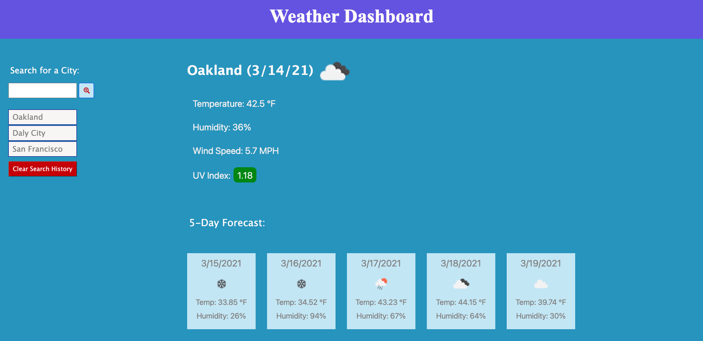

# Work Day Scheduler

## Description
This weather dashboard allows the user to search for a city and the webpage will display the current weather and 5-day forcast of that location. Each search is saved in the search history. It uses the OpenWeather API to retrieve weather data and uses localStorage to store search data. All images and icons are pulled directly form the OpenWeather API. 

## Launch Weather Dashboard 
Try out the dashboard here:  https://telacaul.github.io/weather_dashboard/

## Screenshot

## Challenge Requirements
### User Story
* AS A traveler
* I WANT to see the weather outlook for multiple cities
* SO THAT I can plan a trip accordingly

### Acceptance Criteria
* GIVEN a weather dashboard with form inputs
* WHEN I search for a city
* THEN I am presented with current and future conditions for that city
* WHEN I view current weather conditions for that city
* THEN I am presented with the city name, the date, an icon representation of weather conditions, the temperature, the humidity, the wind speed and the UV index
* WHEN I view the UV index
* THEN I am presented with a color that indicates whether the conditions are favorable, moderate, or severe
* WHEN I view future weather conditions for that city
* THEN I am presented with a 5-day forecast that displays the date, an icon representation of weather conditions, the temperature and the humidity
* WHEN I click on a city in the search history
* THEN I am again presented with current and future conditions for that city
